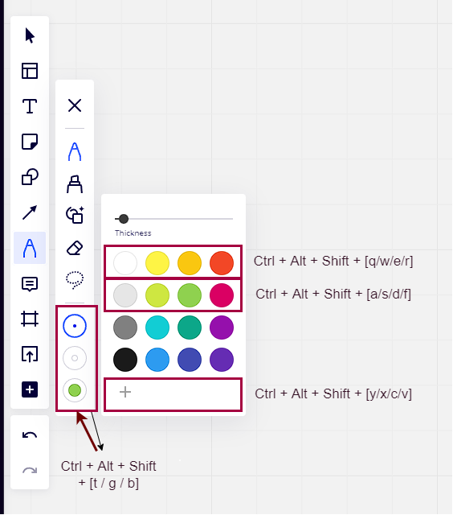

# Miro Shortcuts Script

This userscript adds custom keyboard shortcuts to miro for quick color and pen change.



To install this script, add `https://github.com/DirkHeinke/miro-keyboard-shortcuts-userscript/raw/master/dist/index.user.js
` to [Violentmonkey](https://violentmonkey.github.io/) or [Tampermonkey](https://www.tampermonkey.net/).

The default shortcuts are:
| Shortcut | Function |
| --- | --- |
| Ctrl + Alt + Shift + q | Select color 0 |
| Ctrl + Alt + Shift + w | Select color 1 |
| Ctrl + Alt + Shift + e | Select color 2 |
| Ctrl + Alt + Shift + r | Select color 3 |
| Ctrl + Alt + Shift + a | Select color 4 |
| Ctrl + Alt + Shift + s | Select color 5 |
| Ctrl + Alt + Shift + d | Select color 6 |
| Ctrl + Alt + Shift + f | Select color 7 |
| Ctrl + Alt + Shift + y | Select color 16 |
| Ctrl + Alt + Shift + x | Select color 17 |
| Ctrl + Alt + Shift + c | Select color 18 |
| Ctrl + Alt + Shift + v | Select color 19 |
| Ctrl + Alt + Shift + t | Select pen 0 |
| Ctrl + Alt + Shift + g | Select pen 1 |
| Ctrl + Alt + Shift + b | Select pen 2 |

## Modify Shortcuts

You can replace them by changing the userscript value with the key `shortcuts_v1`. To edit this in Tampermonkey, set the config mode to `Advanced`.

The first string is the shortcut. Most combinations are already used by browser or OS. For details on the format see [here](https://github.com/violentmonkey/vm-shortcut).

The second string is either `selectColor` or `selectPen`.

The third value is passed to the select function and is either the color index (starting at 0) or the pen (0, 1, 2).

This would be the content with the default shortcuts.

```
[
  [
    "c-a-s-q",
    "selectColor",
    0
  ],
  [
    "c-a-s-w",
    "selectColor",
    1
  ],
  [
    "c-a-s-e",
    "selectColor",
    2
  ],
  [
    "c-a-s-r",
    "selectColor",
    3
  ],
  [
    "c-a-s-a",
    "selectColor",
    4
  ],
  [
    "c-a-s-s",
    "selectColor",
    5
  ],
  [
    "c-a-s-d",
    "selectColor",
    6
  ],
  [
    "c-a-s-f",
    "selectColor",
    7
  ],
  [
    "c-a-s-y",
    "selectColor",
    16
  ],
  [
    "c-a-s-x",
    "selectColor",
    17
  ],
  [
    "c-a-s-c",
    "selectColor",
    18
  ],
  [
    "c-a-s-v",
    "selectColor",
    19
  ],
  [
    "c-a-s-t",
    "selectPen",
    0
  ],
  [
    "c-a-s-g",
    "selectPen",
    1
  ],
  [
    "c-a-s-b",
    "selectPen",
    2
  ]
]

```

## Development

This is a userscript initiated from [@violentmonkey/generator-userscript](https://github.com/violentmonkey/generator-userscript).

```sh
# Compile and watch
$ npm run dev

# Build script
$ npm run build

# Lint
$ npm run lint
```
